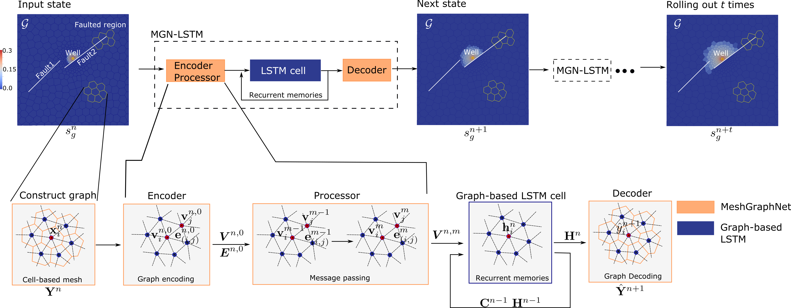

# MGN-LSTM - Learning CO2 Plume Migration in Faulted Reservoirs with Graph Neural Networks

This repository is the implementation of [MGN-LSTM](https://www.sciencedirect.com/science/article/pii/S0098300424001948), a novel graph neural network architecture for building physics-informed surrogate models of CO₂-water multiphase flow in carbon capture and storage (CCS) reservoirs with complex fault systems. Our model combines Message-Passing Graph Neural Networks with Long Short-Term Memory networks to achieve stable long-term predictions of CO₂ plume migration in heterogeneous geological formations. The architecture is specifically designed to handle unstructured simulation meshes and accurately capture flow dynamics around geological faults.

<p align="center"></p>

The figure below compares the high-fidelity numerical simulation (top row) and MGN-LSTM predictions (middle row) for CO₂ saturation evolution in a faulted reservoir over 950 days:

<p align="center"></p>


## Overview

This repository provides:
- Complete Python implementation of MGN-LSTM
- A jupyter notebook for evaluating MGN-LSTM performances
- A faulted PEBI (Perpendicular Bisector) dataset
- Training scripts for gas saturation and pressure
- Pre-trained models

## Requirements

- Python 3.10
- PyTorch 1.9+
- CUDA-capable GPU (recommended)
- Additional dependencies listed in `setup_env.sh`

## Installation

1. Clone the repository:
```bash
git clone https://github.com/IsaacJu-debug/mgn_lstm.git
cd mgn_lstm
```

2. Set up the virtual environment:
```bash
source setup_env.sh
```

This will create a virtual environment and install all required dependencies. The script also generates an activation file (`activate_mgn_lstm.sh`) for future use.

3. For subsequent uses, activate the environment:
```bash
source activate_mgn_lstm.sh
```

## Datasets

Download the benchmark datasets from our [Google Drive repository](https://drive.google.com/drive/folders/1IXCqlKnlf8tPsXrfFRyG_F-ehYK-9JZn?usp=sharing):

- `meshPEBI_sg.pt`: Gas saturation field data
- `meshPEBI_p.pt`: Gas pressure field data

Place the downloaded files in the `mgn_lstm/datasets` directory.

## Pre-trained Models

Pre-trained MGN-LSTM models are available [here](https://drive.google.com/drive/folders/1V5RvJxm4WiEJVZkKur2cf3nUdtKtzPPY?usp=sharing). 

To evaluate the models:
1. Download the pre-trained weights
2. Place them in the `mgn_lstm/best_models` directory
3. Run the evaluation notebook:
```bash
jupyter notebook evaluate_mgn_lstm_gas.ipynb
```

## Training

### Gas Saturation Model
```bash
bash run_lstm_gas.sh
```

### Pressure Field Model
```bash
bash run_lstm_p.sh
```

## Issues

If you encounter any problems, please [open an issue](https://github.com/IsaacJu-debug/mgn_lstm/issues).

## Citation

If you find this work useful in your research, please cite:
```bibtex
@article{ju2024learning,
    title={Learning CO2 plume migration in faulted reservoirs with Graph Neural Networks},
    author={Ju, Xin and Hamon, Fran{\c{c}}ois P and Wen, Gege and Kanfar, Rayan and Araya-Polo, Mauricio and Tchelepi, Hamdi A},
    journal={Computers \& Geosciences},
    volume={193},
    pages={105711},
    year={2024},
    publisher={Elsevier}
}
```

## License

This project is licensed under the MIT License - see the [LICENSE](LICENSE) file for details.
